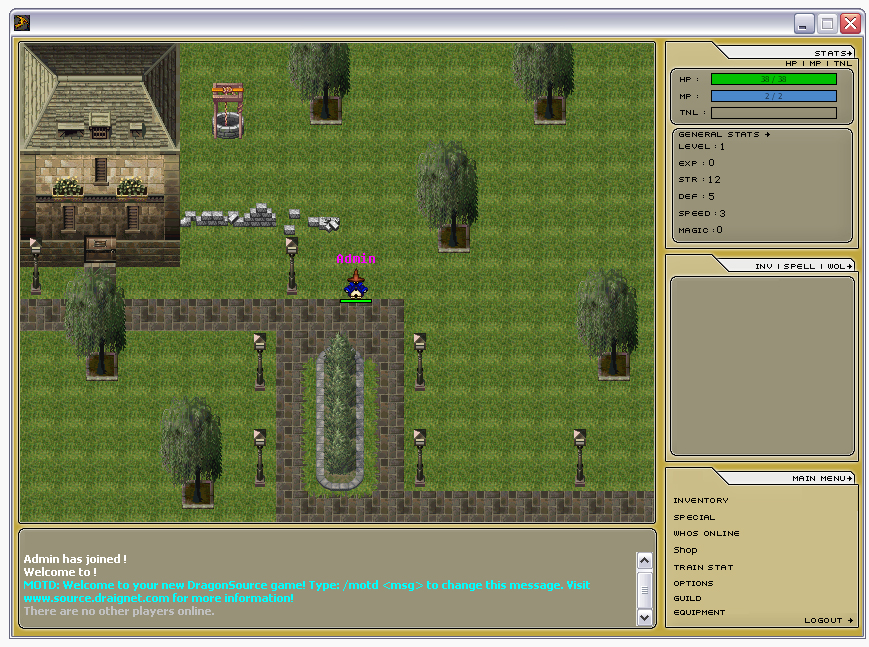



## DragonSource 1\.20

### Description

DragonSource 1.20 is a huge step up from the previous 1.11 release. It has tons of new features including scrolling maps, multiple tilesets, graphical inventory and many many improvements on previous features, as well as a much extended map editor.

Extract with WinRAR: 

http://www.rarlab.com

Visit our website: 

http://www.source.draignet.com

 
### More Info
 

             |
---                |---
**Submitted On**   |2012-02-16 04:29:52
**By**             |[DraigNET](https://github.com/Planet-Source-Code/PSCIndex/blob/master/ByAuthor/draignet.md)
**Level**          |Intermediate
**User Rating**    |5.0 (10 globes from 2 users)
**Compatibility**  |VB 6\.0
**Category**       |[Games](https://github.com/Planet-Source-Code/PSCIndex/blob/master/ByCategory/games__1-38.md)
**World**          |[Visual Basic](https://github.com/Planet-Source-Code/PSCIndex/blob/master/ByWorld/visual-basic.md)
**Archive File**   |[DragonSour2220142172012\.zip](https://github.com/Planet-Source-Code/draignet-dragonsource-1-20__1-74268/archive/master.zip)

